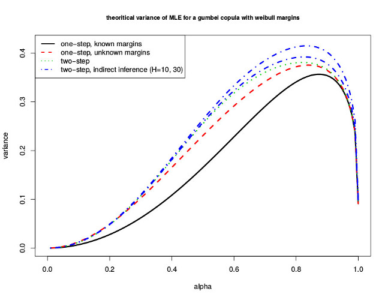

## Presentation for ICORS 2016, Geneva, July 5
joint work with  
Stéphane Guerrier, University of Illinois at Urbana-Champaign   
Maria-Pia Victoria Feser, Université de Genève

---
## Background
 > - Suppose you want to model the joint distribution $(X_1,X_2)\sim F(X_1,X_2)$ of two continuous random variables $X_1\sim F_1$ and $X_2\sim F_2$
 > - But $F_1$ and $F_2$ are different distributions, and multivariate normality is far from ideal
 > - Hopefully, Sklar (1959) tells you that you don't need to model $F(X_1,X_2)$ because $F(X_1,X_2) = C(F_1(X_1),F_2(X_2))$
 > - The function $C(\cdot,\cdot)$ is unique and very flexible!
 > - $C(\cdot,\cdot)$ is a copula function

---
$\DeclareMathOperator*{\argzero}{argzero}$
$\DeclareMathOperator*{\argmin}{argmin}$
## Estimator
 > - We wish to estimate $\boldsymbol\theta^{T} =(\boldsymbol\beta_1^{T},\boldsymbol\beta_2^{T},\boldsymbol\gamma^{T})^{T}$ from the parametric model $C\big(F_1(X_1, \boldsymbol\beta_1),F_2(X_2,\boldsymbol\beta_2),\boldsymbol\gamma\big)$, where $\boldsymbol\theta\in\Theta\subseteq\mathcal{R}^{d}$
 > - Let "$x = \argzero f(x)$" denotes the implicit solution in $x$ such that $f(x) = 0$ 
 > - The one-step estimator to this problem can be written as $$ \hat{\boldsymbol\theta} = \underset{\boldsymbol\theta\in\Theta}{\argzero} \; n^{-1}\sum_{i=1}^{n} \boldsymbol\Psi\big(F_1(X_1, \boldsymbol\beta_1),F_2(X_2,\boldsymbol\beta_2),\boldsymbol\gamma\big)$$
 where $\boldsymbol\Psi(\dots)$ is known vector-valued maps, typically a system of $d$ nonlinear equations
 > - If $\boldsymbol\Psi(\dots)$ is the gradient of the likelihood, $\hat{\boldsymbol\theta}$ is the MLE

---
## Estimator cont
 > - Two-step estimators are more flexible: inference is done independently on $\boldsymbol\beta_1,\boldsymbol\beta_2$, and conditionnaly on $\boldsymbol\gamma \rvert \hat{\boldsymbol\beta}_1,\hat{\boldsymbol\beta}_2$
 > - First, $$ \begin{pmatrix} \hat{\boldsymbol\beta}_1 \\ \hat{\boldsymbol\beta}_2 \end{pmatrix}  = \begin{pmatrix} \argzero \sum_{i=1}^{n} \Psi_1(x_{1i},\boldsymbol\beta_1) \\ \argzero \sum_{i=1}^{n} \Psi_2(x_{2i},\boldsymbol\beta_2) \end{pmatrix} $$
 > - Second, $$ \hat{\boldsymbol\gamma} = \argzero \sum_{i=1}^{n} \Psi_3\left(F_1(x_{i1},\hat{\boldsymbol\beta}_1), F_2(x_{i2},\hat{\boldsymbol\beta}_2),\boldsymbol\gamma\right)$$  

---
## Influence function 
 > - For margins, the data generating mechanism (DGP) is $$ F_{\epsilon} = (1-\epsilon) F_{\boldsymbol\beta_j} + \epsilon\Delta_{z_j}, \quad 0\leq\epsilon\ll 1$$  
 > - The DGP of bivariate distribution is $$ C_{\delta(\epsilon)} = (1-\delta(\epsilon))C_{\boldsymbol\theta} + \delta(\epsilon)\Delta_{\mathbf{z}} $$ where $\Delta_{\mathbf{z}}$ is the bivariate dirac distribution function
 > - $\delta(\epsilon)$ is the overall proportion of random variable (rv) generated by $\Delta_{\mathbf{z}}$, i.e., if $(O_1,O_2)$ denotes bivariate dichotomeous latent variables of observing a rv from $\Delta_{\mathbf{z}}$, then $$\delta(\epsilon) = P(O_1=1,O_2=0) + P(O_1=0,O_2=1) + P(O_1=1,O_2=1)$$
 > - Generally in the litterature $\delta(\epsilon)=\epsilon$ (discussed later)

---
## Influence function cont
 > - Assume estimators are Fisher consistent, i.e. $\hat{\boldsymbol\beta}_j(F_{\boldsymbol\beta_j}) = \boldsymbol\beta_j^{0}$ and $\hat{\boldsymbol\gamma}(C_{\boldsymbol\gamma}) = \boldsymbol\gamma_0$
 > - Then the influence function of the copula estimator $\hat{\boldsymbol\gamma}$ is given by $\begin{align*} \mbox{IF}(\mathbf{z}; \hat{\boldsymbol\gamma}, C_{\boldsymbol\gamma}) &= \mathbf{M}^{-1}_3 \Bigg\{\left(2 - \frac{\partial}{\partial\epsilon}\delta(\epsilon)\big\rvert_{\epsilon=0}\right) \Psi_3(F_1(z_1,\boldsymbol\beta_1),F_2(z_2,\boldsymbol\beta_2),\boldsymbol\gamma) \\ & \qquad + \sum_{j=1}^2 \mathbf{B}_j \mbox{IF}(z_j; \hat{\boldsymbol\beta}_j, F_{\boldsymbol\beta_j})\Bigg\} \end{align*}$
 > - $\mathbf{B}_j = \mathbb{E}_{C_{\boldsymbol\gamma}}\frac{\partial}{\partial\boldsymbol\beta_j}\Psi_3(F_1(z_1,\boldsymbol\beta_1),F_2(z_2,\boldsymbol\beta_2),\boldsymbol\gamma)$
 > - $\mbox{IF}(z_j; \hat{\boldsymbol\beta}_j, F_{\boldsymbol\beta_j}) = \mathbf{M}^{-1}_j \Psi_j(z_j,\boldsymbol\beta_j)$ is the influence function from margins

---
## Influence function cont
 > - $\mbox{IF}(\mathbf{z}; \hat{\boldsymbol\gamma}, C_{\boldsymbol\gamma}) \propto \sum_{j=1}^{2} \mbox{IF}(z_j; \hat{\boldsymbol\beta}_j, F_{\boldsymbol\beta_j})$, margins estimators influence dependence estimator: $\Psi_j$ must be bounded!
 > - $\mbox{IF}(\mathbf{z}; \hat{\boldsymbol\gamma}, C_{\boldsymbol\gamma}) \propto \Psi_3(F_1(z_1,\boldsymbol\beta_1),F_2(z_2,\boldsymbol\beta_2),\boldsymbol\gamma_0)$, the $\Psi$-function for the copula parameter must be bounded as well!
  > - $\mbox{IF}(\mathbf{z}; \hat{\boldsymbol\gamma}, C_{\boldsymbol\gamma}) \propto \left(2 - \frac{\partial}{\partial\epsilon}\delta(\epsilon)\big\rvert_{\epsilon=0}\right)$

---
## Influence function cont
 > - Without loss of generality, let assume that $P(O_j=1) = \epsilon$ and $P(O_1=1,O_2=1) = \epsilon^{a}$ for some parameter $a\geq 1$
 > - If $a\to 1$ $(O_1,O_2)$ are comonotonic and $\frac{\partial}{\partial\epsilon}\delta(\epsilon)\big\rvert_{\epsilon=0} = 1$
 > - If $a=2$ then $(O_1,O_2)$ are independent and $\frac{\partial}{\partial\epsilon}\delta(\epsilon)\big\rvert_{\epsilon=0} = 0$
 > - If $a\to\infty$ $(O_1,O_2)$ are countercomonotonic and $\frac{\partial}{\partial\epsilon}\delta(\epsilon)\big\rvert_{\epsilon=0} = 0$
 > - For any fixed $\mathbf{z}$, $||\mbox{IF}(\mathbf{z}; \hat{\boldsymbol\gamma}, C_{\boldsymbol\gamma}, a)||^{2} > || \mbox{IF}(\mathbf{z}; \hat{\boldsymbol\gamma}, C_{\boldsymbol\gamma},a=1) ||^{2}$ for any $a>1$

---
## Robust estimator
 > - A viable candidate to obtain robust estimators is the weighted MLE
 > - We are looking for the two-step solution $$ \hat{\boldsymbol\theta}  = \begin{pmatrix} \argzero \sum_{i=1}^{n} \widetilde{\Psi}_1(x_{1i},\boldsymbol\beta_1) - \mathbb{E}_{F_{\boldsymbol\beta_1}}(\widetilde{\Psi_1})  \\ \argzero \sum_{i=1}^{n} \widetilde{\Psi}_2(x_{2i},\boldsymbol\beta_2) - \mathbb{E}_{F_{\boldsymbol\beta_2}}(\widetilde{\Psi_2}) \\ \argzero \sum_{i=1}^{n} \widetilde{\Psi}_3\left(F_1(x_{i1},\hat{\boldsymbol\beta}_1), F_2(x_{i2},\hat{\boldsymbol\beta}_2),\boldsymbol\gamma\right) - \mathbb{E}_{C_{\boldsymbol\gamma}}(\widetilde{\Psi}_3) \end{pmatrix} $$
 where $\widetilde{\Psi}_j = \mathbf{w}_j(x_j,\boldsymbol\beta_j,c_j) \odot \mathbf{s}(x_j,\boldsymbol\beta_j)$

---
## Robust estimator cont
 > - Or equivalently $$ \hat{\boldsymbol\theta}  = \begin{pmatrix} \argmin \lVert\hat{\boldsymbol\pi}_1 - \boldsymbol\pi(\boldsymbol\beta_1,F_{\boldsymbol\beta_1})\rVert^{2}  \\ \argmin \lVert\hat{\boldsymbol\pi}_2 - \boldsymbol\pi(\boldsymbol\beta_2,F_{\boldsymbol\beta_2})\rVert^{2} \\ \argmin \lVert\hat{\boldsymbol\pi}_3(\hat{\boldsymbol\beta}_1,\hat{\boldsymbol\beta}_2) - \boldsymbol\pi(\boldsymbol\gamma,C_{\boldsymbol\gamma})\rVert^{2} \end{pmatrix} $$
 > - $\hat{\boldsymbol\pi}$ is a biased estimator on the data, for eg $\hat{\boldsymbol\pi}_j = \argzero \sum_{i=1}^{n}\widetilde{\Psi}_j(x_{ij},\boldsymbol\beta_j)$
 > - If $\boldsymbol\pi(\cdot,\cdot)$ is unknown, it can be estimated by $\hat{\boldsymbol\pi}^{H}(\cdot,\cdot)$, $\hat{\boldsymbol\pi}$  estimated $H$ times on pseudo-drawn observations (indirect inference)
 > - Exact form of neither $\boldsymbol\pi(\cdot,\cdot)$ nor $\mathbb{E}(\widetilde{\Psi}_j)$ are required
 > - Two-step indirect M-estimator $$ \hat{\boldsymbol\theta}^H  = \begin{pmatrix} \argmin \lVert\hat{\boldsymbol\pi}_1 - \hat{\boldsymbol\pi}^H(\boldsymbol\beta_1,F_{\boldsymbol\beta_1})\rVert^{2}  \\ \argmin \lVert\hat{\boldsymbol\pi}_2 - \hat{\boldsymbol\pi}^H(\boldsymbol\beta_2,F_{\boldsymbol\beta_2})\rVert^{2} \\ \argmin \lVert\hat{\boldsymbol\pi}_3(\hat{\boldsymbol\beta}_1,\hat{\boldsymbol\beta}_2) - \hat{\boldsymbol\pi}^H(\boldsymbol\gamma,C_{\boldsymbol\gamma})\rVert^{2} \end{pmatrix} $$

---
## Consistency
 > - First, we use the results from Huber (1967) to prove that $\hat{\boldsymbol\pi}\overset{\tiny\mbox{a.s.}}{\longrightarrow}\boldsymbol\pi_0$ (under some technical conditions)
 > - Second, we use the basic consistency theorem of Engle and McFadden (1994) to prove that $\hat{\boldsymbol\theta}^{H}\overset{\tiny\mbox{a.s.}}{\longrightarrow}\boldsymbol\theta_0$, for any fixed $H<\infty$
 > - The proof relies on some technical conditions, plus a strong condition for identifiability : 
 > - (A) The function $\boldsymbol\pi(\boldsymbol\theta)$ is one-to-one

---
## Asymptotic Normality
 > - First, we use results from Huber (1967) to prove asymptotic normality of $\sqrt{n}(\hat{\boldsymbol\pi}_j - \hat{\boldsymbol\pi}_j^{H})\overset{\tiny\mbox{d}}{\longrightarrow}\mathcal{N}\left(0,(1+\frac{1}{H})\Lambda_j\right)$ where $\Lambda_j=M^{-1}_jP_{jj}M^{-T}_j$ is the sandwich-form covariance matrix
 > - Second, we use the the asymptotic normality theorem of Engle and McFadden (1994) to prove the asymptotic normality $\sqrt{n}(\hat{\boldsymbol\beta}_j - \boldsymbol\beta_j^{0})\overset{\tiny\mbox{d}}{\longrightarrow}\mathcal{N}\left(0,\Sigma_j\right)$ where $\Sigma_j = (1+\frac{1}{H})G_j^{T}\Lambda_jG_j$ and $G_j = \frac{\partial}{\partial\boldsymbol\beta_j^{T}}\boldsymbol\pi(\boldsymbol\beta_j)$
 > - $\sqrt{n}(\hat{\boldsymbol\theta}^H-\boldsymbol\theta_0)\overset{\tiny\mbox{d}}{\longrightarrow}\mathcal{N}\left(0,\boldsymbol\Sigma\right)$, $\boldsymbol\Sigma$ is a nine blocks symmetric matrix
 > - The last block, the covariance matrix of $\hat{\gamma}$, is given by $$ \begin{align*} \Sigma_{33} &= G^{-1}_3M^{-1}_3 \bigg( (1+H^{-1})P_{33} + (1+H^{-1})\sum_{i=1}^2 B_i\Lambda_iB_i^T \\ & \qquad -2\sum_{i=1}^2P_{3i}M_i^{-T}B_i^{T} + 2B_1M_1^{-1}P_{12}M_2^{-T}B_2^T \bigg) M^{-T}_3G^{-T}_3 \end{align*}$$

---

## Efficiency
 > - You lose efficiency: one-step $\longrightarrow$ two-step estimator
 > - Again you lose efficiency by solving by indirect inference ($H<\infty$)
 > - </img>

---
## Bootstrap strategy
 > - You want to estimate $\widehat{\Sigma}_{33}$, but parametric bootstrap is too slow
 > - Idea: use the asymptotic distribution of $(\hat{\boldsymbol\beta}_1^{T},\hat{\boldsymbol\beta}_2^T)^T$
 > - 0. You estimated $\hat{\boldsymbol\theta}$
 > - First step:
 > - 1. Generate the pair $(x_1,x_2)^{(b)}$ from $C_{\hat{\boldsymbol\theta}}$
 > - 2. Estimate $\hat{\boldsymbol\pi}^{(b)}_j$ for $j=1,2$
 > - 3. Repeat 1. and 2. for $b=1,\dots,B$
 > - 4. Estimate $\widehat{\Lambda}_{ji} = \frac{1}{B-1}\sum_{b=1}^B (\hat{\boldsymbol\pi}^{(b)}_j - \bar{\boldsymbol\pi}^{(b)}_j)^T(\hat{\boldsymbol\pi}^{(b)}_i - \bar{\boldsymbol\pi}^{(b)}_i)$ for $i,j=1,2$
 > - 5. Compute the blocks $\widehat{\Sigma}_{11}$, $\widehat{\Sigma}_{22}$ and $\widehat{\Sigma}_{21}$
 > - It gives an estiate of the covariance matrix of $(\hat{\boldsymbol\beta}_1^{T},\hat{\boldsymbol\beta}_2^T)^T$

---
## Bootstrap strategy cont
 > - Second step:
 > - 1. Generate (or recycle) the pair $(x_1,x_2)^{(b)}$ from $C_{\hat{\boldsymbol\theta}}$
 > - 2. Generate the pair $(\hat{\boldsymbol\beta}_1,\hat{\boldsymbol\beta}_2)^{(b)}$ from $\mathcal{MN}\left( \begin{pmatrix} \hat{\boldsymbol\beta}_1 \\ \hat{\boldsymbol\beta}_2 \end{pmatrix}, \begin{pmatrix} \widehat{\Sigma}_{11} & \widehat{\Sigma}_{21}^T \\ \widehat{\Sigma}_{21} & \widehat{\Sigma}_{22} \end{pmatrix}\right)$
 > - 3. Estimate the pair $(u_1^T,u_2^T)^{(b)} = (F_1(x_1,\hat{\boldsymbol\beta}_1^{(b)}),F_1(x_1,\hat{\boldsymbol\beta}_2^{(b)}))$
 > - 4. Estimate $\hat{\pi}^{(b)}_3$
 > - 5. Repeat 1. to 4. for $b=1,\dots,B$
 > - 6. Estimate $\widehat{\Lambda^*}_{33} = \frac{1}{B-1}\sum_{b=1}^B (\hat{\boldsymbol\pi}^{(b)}_3 - \bar{\boldsymbol\pi}^{(b)}_3)^T(\hat{\boldsymbol\pi}^{(b)}_3 - \bar{\boldsymbol\pi}^{(b)}_3)$
 > - 7. Compute $\widehat{\Sigma}_{33}$

--- 
## Thank you for your attention!
 - Huber (1967). The behaviour of maximum likelihood estimates under nonstandard conditionis. In Proceedings of the fifth Berkeley symposium on mathematical statistics and probability.
 - Newey and McFadden (1994). Large sample estimation and hypothesis testing. Handbook of econometrics
